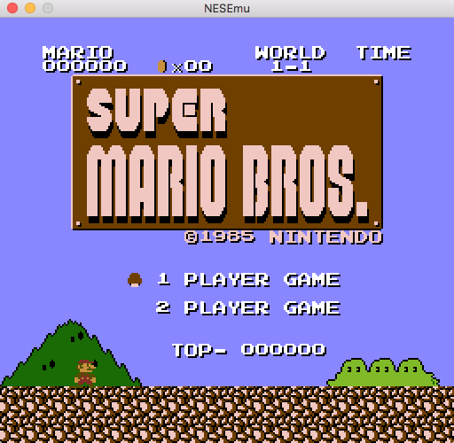

https://user-images.githubusercontent.com/767599/120933065-bec98900-c6f8-11eb-93a7-dbee897467e1.mp4

# NESEmu
Portable NES Emulator, cycle accurate for CPU, PPU and APU.

NESEmu is a NES emulator written in C++ with these goals in mind (and in order) :

1) Try to be the most accurate possible :

- It is based on the essential informations provided in http://nesdev.com wiki and forum.
- To cover most of the obscure details, tests was made on the excellent visual tools :

-- For the general 6502 CPU : http://visual6502.org/JSSim/index.html

-- For the specific 2A03 CPU / APU : http://www.qmtpro.com/~nes/chipimages/visual2a03/

-- For the 2C02 PPU : https://www.qmtpro.com/~nes/chipimages/visual2c02/
- It runs almost all the tests ROM provided by the community without having some hack to pass them

2) Try to be the most portable possible :

- The emulation is fully decoupled from interfacing with real hardware :

-- You provide a GraphicManager which will receive pixel coordinates and color to plot and a notification when VBlank starts to allow you to blit buffer

-- You provide a SoundManager which will receive sample value at time to fill your audio buffer

-- You provide some ControllerManager which will be polled when needed to receive your inputs

-- You provide either a lambda, a function, a method, a functor to run the NES or you can control yourself the run loop
- The code is written in standard C++14
- It doesn't depend on any library (except SDL2 but only for the main.cpp example, see below)
- The code is provided with a small main.cpp example which use SDL2 to interface with OS, it compile and run on OSX, Windows and Linux without any code modification

3) Try to be the most well designed possible :
- The code is written to be the most readable possible (explicit variables / functions / classes / members / methods name)
- The 6502 CPU code can be used for any other project, it is decoupled from 2A03 CPU
- The internals of the NES are coupled like the original NES hardware :

-- 2A03 is 6502 + DMA + APU, it communicate with the PPU / memory by the NES bus

-- 2C02 is decoupled and communicate with the CPU / memory by the NES bus

-- NES is 2A03 + 2C02 + cartridge interface + controller ports + communication bus

-- Mappers are decoupled from 2A03 / 2C02, they communicates only by NES bus, it means that there is no mapper code outside mapper (even for scanline detection)

3) Try to be with the less bug possible :

- It has unit test cases to cover the majority of the CPU, PPU and DMA code by using the visual tools log files
- It uses the modern C++ tools to reduce errors like memory leak, double free or pointer dangling (uses smart pointer)

But NESEmu is in early development :

- It is not very optimized (only run at +-205 FPS on my computer when other emulator run at +500FPS)
- It has only a few mapper
- It emulates only the NTSC NES (2A03 + 2C02)
- It has only two controllers types (standard and zapper)
- It doesn't emulate the NTSC signal, it uses palette data to provide colors
- It doesn't emulate the Famicom Disk System
- Except the main.cpp example provided, there is no code to manage the outside of the emulator (save state, options like graphic / audio / controllers, cheat code, debugger, ...)
- And many more ... but all of this will be fixed on future development

## Try it

Here is some informations to try the emulator :

- You can use your favorite C++ compiler and IDE, I personnaly use XCode on OSX and VisualC++ on Windows
- Don't forget to setup SDL2 before : https://www.libsdl.org/download-2.0.php
- Once started, drag a rom file on the window app to run this rom
- Use these keys : Directional = Arrows, Button B = C, Button A = V, Select = Space and Start = Enter
- Use R key to perform a reset
- Use the Command+Q (OSX) / Alt+F4 (Windows) to exit app like any other app
